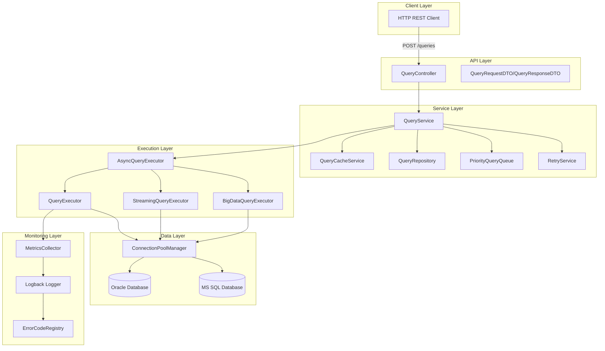
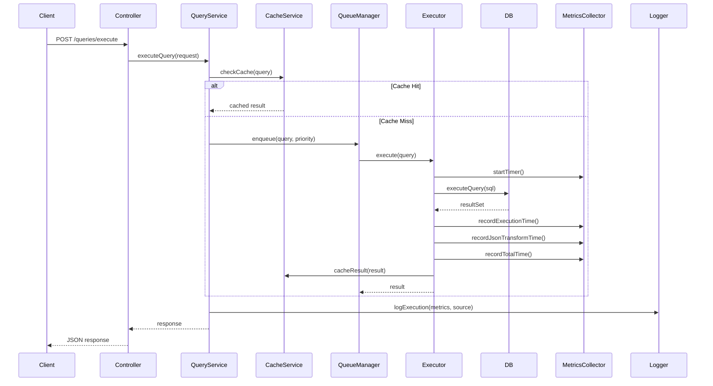

# Query Service Implementation Plan

## Overview

This plan outlines the implementation of a Spring Boot Gradle Kotlin reactive query service that executes SQL queries on Oracle and MS SQL Server databases via HTTP REST API. The service will be fully async, non-blocking, and support advanced features like caching, prioritization, streaming, and comprehensive monitoring.

## Architecture Diagram



## Feature List and Implementation Details

### 1. Project Setup (Spring Boot Gradle Kotlin)

**Files:**

- `build.gradle.kts` - Gradle build configuration
- `settings.gradle.kts` - Gradle settings
- `src/main/kotlin/com/queryservice/QueryServiceApplication.kt` - Main application class
- `src/main/resources/application.yml` - Application configuration

**Dependencies:**

- Spring Boot WebFlux (reactive)
- Spring Data R2DBC (reactive database access)
- Kotlin Coroutines
- HikariCP (connection pooling)
- Oracle JDBC Driver
- MS SQL JDBC Driver
- Jackson (JSON)
- Spring Cache (caching)
- Logback Classic

### 2. HTTP REST API for Query Execution

**Files:**

- `src/main/kotlin/com/queryservice/api/QueryController.kt` - REST controller
- `src/main/kotlin/com/queryservice/api/dto/QueryRequestDTO.kt` - Request DTO
- `src/main/kotlin/com/queryservice/api/dto/QueryResponseDTO.kt` - Response DTO
- `src/main/kotlin/com/queryservice/api/dto/QueryExecutionRequest.kt` - Execution request

**Endpoints:**

- `POST /api/v1/queries/execute` - Execute a new query
- `POST /api/v1/queries/{queryId}/execute` - Execute a saved query
- `GET /api/v1/queries/{queryId}` - Get saved query details
- `POST /api/v1/queries` - Save a new query
- `GET /api/v1/queries/{queryId}/stream` - Stream query results (paginated)

**Features:**

- Request validation
- Source tracking (who sent the query)
- Parameter placeholder support

### 3. Multi-Database Support (Oracle & MS SQL)

**Files:**

- `src/main/kotlin/com/queryservice/database/DatabaseType.kt` - Enum for database types
- `src/main/kotlin/com/queryservice/database/DatabaseConfig.kt` - Database configuration
- `src/main/kotlin/com/queryservice/database/ConnectionFactory.kt` - Connection factory

**Implementation:**

- Separate connection pools for each database type
- Database type detection from query request
- Database-specific query parameter handling

### 4. Saved Queries (Query ID Lookup)

**Files:**

- `src/main/kotlin/com/queryservice/repository/QueryRepository.kt` - Query repository interface
- `src/main/kotlin/com/queryservice/repository/QueryEntity.kt` - JPA entity for saved queries
- `src/main/kotlin/com/queryservice/repository/JpaQueryRepository.kt` - JPA implementation
- Database schema: `queries` table with columns: id, name, sql, database_type, parameters_schema, created_by, created_at

**Fields:**

- Query ID (UUID)
- SQL statement
- Database type
- Parameter schema (JSON)
- Created by (source tracking)

### 5. Placeholder Parameters in Queries

**Files:**

- `src/main/kotlin/com/queryservice/query/ParameterResolver.kt` - Parameter resolution
- `src/main/kotlin/com/queryservice/query/ParameterValidator.kt` - Parameter validation

**Implementation:**

- Support for named parameters (`:paramName`) and positional parameters (`?`)
- Parameter type validation
- SQL injection prevention
- Database-specific parameter binding

### 6. Async/Reactive/Non-Blocking Execution

**Files:**

- `src/main/kotlin/com/queryservice/execution/AsyncQueryExecutor.kt` - Async executor
- `src/main/kotlin/com/queryservice/execution/ReactiveQueryService.kt` - Reactive service wrapper

**Implementation:**

- Spring WebFlux for reactive HTTP handling
- Kotlin Coroutines for async execution
- Non-blocking I/O for database operations
- Return `Mono<QueryResponse>` or `Flux<QueryRow>` for streaming

### 7. Caching (Query and Result Set)

**Files:**

- `src/main/kotlin/com/queryservice/cache/QueryCacheService.kt` - Cache service
- `src/main/kotlin/com/queryservice/cache/CacheKeyGenerator.kt` - Cache key generation
- `src/main/kotlin/com/queryservice/cache/CacheConfig.kt` - Cache configuration

**Implementation:**

- Spring Cache abstraction with Caffeine or Redis
- Cache key: query SQL + parameters + database type
- Configurable TTL per query
- Optional result set caching
- Cache invalidation strategies

### 8. Query Duration Logging

**Files:**

- `src/main/kotlin/com/queryservice/monitoring/QueryMetricsCollector.kt` - Metrics collection
- `src/main/kotlin/com/queryservice/monitoring/ExecutionTimer.kt` - Execution timer
- `src/main/kotlin/com/queryservice/monitoring/QueryExecutionContext.kt` - Execution context

**Metrics Captured:**

- Query execution duration (database time)
- JSON transformation duration
- Total request duration
- Logged with structured logging (JSON format)

### 9. Big Data Queries (File Export)

**Files:**

- `src/main/kotlin/com/queryservice/execution/BigDataQueryExecutor.kt` - Big data executor
- `src/main/kotlin/com/queryservice/export/FileExporter.kt` - File export service
- `src/main/kotlin/com/queryservice/export/ExportFormat.kt` - Export format enum (CSV, JSON, Excel)

**Implementation:**

- Detect `bigData: true` flag in request
- Stream results to file (CSV/JSON/Excel)
- Return file download URL or stream file directly
- Async file generation
- Cleanup temporary files

### 10. Query Prioritization

**Files:**

- `src/main/kotlin/com/queryservice/queue/PriorityQueryQueue.kt` - Priority queue
- `src/main/kotlin/com/queryservice/queue/QueryPriority.kt` - Priority enum (HIGH, NORMAL, LOW)
- `src/main/kotlin/com/queryservice/queue/QueueManager.kt` - Queue manager
- `src/main/kotlin/com/queryservice/queue/QueryWorker.kt` - Worker threads

**Implementation:**

- Priority queue (heap-based) for query execution
- Separate worker pools per priority level
- Configurable queue sizes
- Queue metrics and monitoring

### 11. Connection Pooling

**Files:**

- `src/main/kotlin/com/queryservice/database/ConnectionPoolManager.kt` - Pool manager
- `src/main/kotlin/com/queryservice/database/PoolConfig.kt` - Pool configuration

**Implementation:**

- HikariCP for connection pooling
- Separate pools per database type
- Configurable pool sizes (min, max, idle timeout)
- Pool health monitoring
- Connection leak detection

### 12. Configurable Retries on Failure

**Files:**

- `src/main/kotlin/com/queryservice/retry/RetryService.kt` - Retry service
- `src/main/kotlin/com/queryservice/retry/RetryConfig.kt` - Retry configuration
- `src/main/kotlin/com/queryservice/retry/RetryPolicy.kt` - Retry policy

**Implementation:**

- Spring Retry or custom retry mechanism
- Configurable max retries per query
- Exponential backoff
- Retryable vs non-retryable exceptions
- Retry metrics

### 13. Error Codes for Logged Errors

**Files:**

- `src/main/kotlin/com/queryservice/error/ErrorCodeRegistry.kt` - Error code registry
- `src/main/kotlin/com/queryservice/error/ErrorCodes.kt` - Error code constants
- `src/main/kotlin/com/queryservice/error/QueryServiceException.kt` - Custom exception

**Error Code Format:**

- `QRS-ERR-XXX` where XXX is a 3-digit number
- Examples:
  - QRS-ERR-001: Invalid query request
  - QRS-ERR-002: Database connection failure
  - QRS-ERR-003: Query execution timeout
  - QRS-ERR-568: (as specified by user)

### 14. Query Source Tracking

**Files:**

- `src/main/kotlin/com/queryservice/tracking/QuerySourceTracker.kt` - Source tracking
- `src/main/kotlin/com/queryservice/tracking/QueryMetadata.kt` - Query metadata

**Implementation:**

- Capture from HTTP headers: `X-Request-Source`, `X-User-Id`, `X-Client-Id`
- Store in query execution context
- Log with every query execution
- Store in saved queries table

### 15. Web Client Streaming (Pagination)

**Files:**

- `src/main/kotlin/com/queryservice/streaming/StreamingQueryExecutor.kt` - Streaming executor
- `src/main/kotlin/com/queryservice/streaming/PaginationConfig.kt` - Pagination config
- `src/main/kotlin/com/queryservice/api/dto/StreamResponseDTO.kt` - Stream response DTO

**Implementation:**

- Server-Sent Events (SSE) or reactive streaming
- Configurable page size
- Cursor-based or offset-based pagination
- Return `Flux<QueryRow>` for reactive streaming
- Client can cancel stream

### 16. Logback Configuration

**Files:**

- `src/main/resources/logback-spring.xml` - Logback configuration
- `src/main/resources/logback-spring-dev.xml` - Development profile
- `src/main/resources/logback-spring-prod.xml` - Production profile

**Configuration:**

- Structured JSON logging for production
- Console logging for development
- Separate appenders for query logs, error logs, metrics
- Log rotation policies
- Include error codes in all error logs

## Data Flow Diagram



## Database Schema

### queries table

```sql
CREATE TABLE queries (
    id VARCHAR(36) PRIMARY KEY,
    name VARCHAR(255),
    sql TEXT NOT NULL,
    database_type VARCHAR(20) NOT NULL,
    parameters_schema JSON,
    created_by VARCHAR(255),
    created_at TIMESTAMP,
    updated_at TIMESTAMP
);
```

### query_executions table (optional for audit)

```sql
CREATE TABLE query_executions (
    id VARCHAR(36) PRIMARY KEY,
    query_id VARCHAR(36),
    executed_at TIMESTAMP,
    execution_duration_ms BIGINT,
    json_transform_duration_ms BIGINT,
    total_duration_ms BIGINT,
    source VARCHAR(255),
    status VARCHAR(20),
    error_code VARCHAR(20)
);
```

## Configuration Properties

Key configuration in `application.yml`:

- Database connection strings (Oracle, MS SQL)
- Connection pool settings
- Cache configuration (TTL, size)
- Retry configuration (max retries, backoff)
- Queue configuration (sizes, worker threads)
- Logging configuration
- File export settings (temp directory, formats)

## Implementation Order

1. **Phase 1: Foundation**
   - Project setup (Gradle, Spring Boot)
   - Basic REST controller
   - Database connection setup
   - Logback configuration

2. **Phase 2: Core Execution**
   - Query executor
   - Parameter resolution
   - Async execution
   - Error handling with error codes

3. **Phase 3: Advanced Features**
   - Caching
   - Saved queries
   - Connection pooling
   - Source tracking

4. **Phase 4: Optimization**
   - Query prioritization
   - Retry mechanism
   - Streaming/pagination
   - Metrics collection

5. **Phase 5: Big Data & Export**
   - Big data executor
   - File export functionality

6. **Phase 6: Monitoring & Logging**
   - Comprehensive logging
   - Error code registry
   - Performance metrics

## Testing Strategy

- Unit tests for each service layer
- Integration tests for database operations
- Reactive test support (StepVerifier)
- Mock database connections for testing
- Performance tests for concurrent queries

